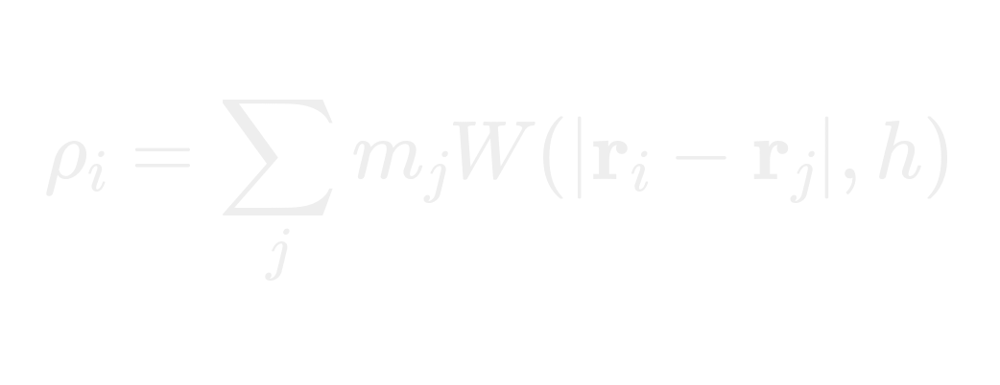
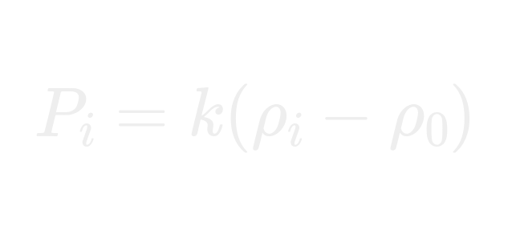
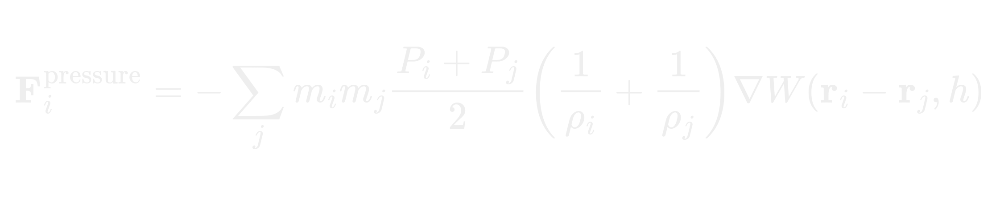
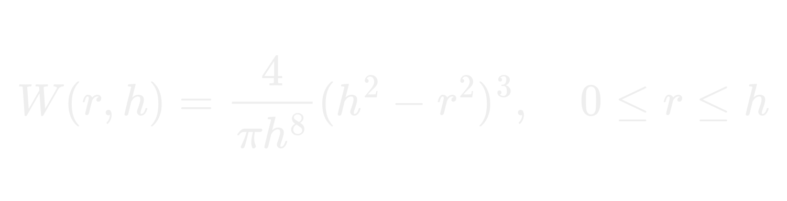

# Fluid Simulation using SPH (Smooth Particle Hydrodynamics)

A research-inspired 2D particle-based fluid simulation implemented in C++, powered by SDL3, OpenGL, and ImGui.
This project demonstrates the fundamentals of Smooth Particle Hydrodynamics (SPH) for real-time fluid simulation, balancing numerical stability, efficiency, and visual clarity.

## 📖 Abstract

Fluid Simulation has been a cornerstone problem in both physics-based animation and real-world engineering. This project presents a 2D SPH-based fluid solver implemented from scratch. It integrates real-time visualization via OpenGL and interactive parameter control with ImGui. The work takes inspiration from Sebastian Lague’s intuitive visualizations and is guided by [research literature in SPH modeling], blending theoretical insights with practical engineering.

The simulation models fluid as a collection of discrete particles whose properties (density, pressure, velocity) are computed by weighted kernel interpolation. This method is widely used in computer graphics and computational physics due to its mesh-free, flexible nature.

## 1. Introduction

Fluid dynamics has historically been modeled using grid-based methods (e.g., **Navier–Stokes solvers on structured grids**). However, SPH provides a mesh-free, particle-driven formulation, where the fluid is represented as a discrete set of particles. Each particle carries physical properties (mass, velocity, density, pressure) and interacts with its neighbors through smoothing kernels.

The objective of this project is to **simulate fluid-like behavior in 2D** while maintaining real-time interactivity. Users can manipulate parameters dynamically using the ImGui interface, making the system both a simulation tool and a learning platform.

## 2. Governing Equations

The system is modeled using the fundamental SPH interpolation equations.

2.1 SPH Interpolation

A continuous field property **A(r)** is approximated as:

Where W is the smoothing kernel, h is the smoothing length, and the sum is over neighboring particles.

- **Aj ​→ property of particle 𝑗**
- **𝑚𝑗 → mass of particle 𝑗**
- **ρj → density of particle 𝑗**
- **𝑊 → smoothing kernel (Poly6 used here)**
- **h → smoothing radius**

## 2.2 Density Estimation

The density at particle i is computed as:

This ensures mass conservation and defines the compressibility of the fluid.

## 2.3 Pressure and Equation of State

Fluid pressure is obtained using a simplified equation of state:

- **Pi ​ → pressure of particle 𝑖**
- **ρ0 ​→ target rest density**
- **k → pressure multiplier (stiffness factor)**

## 2.4 Pressure Force

The pressure gradient between particles contributes to the net force:

- **F_pressure ​→ pressure force on particle 𝑖**
- **mj → mass of particle 𝑗**
- **Pi, Pj → pressures of particles 𝑖 and 𝑗**
- **ρi, ρj → densities of particles 𝑖 and 𝑗**

## 2.5 Smoothing Kernel

This project uses the Poly6 Kernel in 2D:

**Where r is the distance between particles, h is the smoothing length, and C is a normalization constant.**

## 3. Implementation Details

The simulation is implemented in C++ with the following key components:

- **Particle System**: Each particle is represented as a struct containing position, velocity, density, pressure, and force vectors.

- **Neighbor Search**: A spatial grid is used to efficiently find neighboring particles within the smoothing radius.

- **Time Integration**: A simple explicit Euler method is used to update particle positions and velocities based on computed forces.

- **Boundary Conditions**: Particles are constrained within a defined simulation box, with simple collision response to prevent escape.

- **Rendering**: OpenGL is used to visualize particles as points, with color coding based on density or pressure for better visual feedback.

- **User Interface**: ImGui provides a real-time interface for adjusting simulation parameters such as viscosity, pressure stiffness, and particle count.

## 4. Results and Discussion

The simulation successfully demonstrates fluid-like behavior, including splashing, merging, and settling. The real-time parameter adjustment allows users to explore different fluid properties interactively.

### Performance

The simulation runs efficiently at interactive frame rates for moderate particle counts (up to a few thousand particles). Performance can be further optimized by implementing more advanced neighbor search techniques (e.g., spatial hashing or k-d trees).

### Limitations

- The current implementation is limited to 2D and does not account for complex boundary interactions or surface tension effects.

- Numerical stability can be an issue at high particle densities or extreme parameter values, requiring careful tuning.
- The explicit Euler integration method may lead to inaccuracies over long simulation times; more advanced integrators could improve stability.

## 5. Conclusion

This project presents a foundational implementation of 2D fluid simulation using the SPH method. It combines theoretical principles with practical coding techniques to create an interactive and educational tool. Future work could extend the simulation to 3D, incorporate more sophisticated physical effects, and optimize performance for larger particle systems.

## 6. Future Work

To evolve this from an intermediate to an advanced-level SPH simulator, the following features are planned:

- ✅ Viscosity modeling (artificial and physical viscosity)

- ✅ Surface tension for realistic droplet formation

- ✅ PCISPH/DFSPH solvers for incompressibility
 
- ✅ GPU acceleration for large-scale real-time simulation
 
- ✅ Fluid–rigid body coupling

## 7. References

- **Sebastian Lague's SPH Series**: [YouTube Link](https://www.youtube.com/watch?v=rSKMYc1CQHE&t=355s)
- **SPH Research Papers**: [A Comprehensive Introduction to SPH](https://www.researchgate.net/publication/220660290_A_comprehensive_introduction_to_SPH_method)
- **SDL3 Documentation**: [SDL Official Site](https://www.libsdl.org/)
- **ImGui Documentation**: [ImGui GitHub](https://github.com/ocornut/imgui)
- **OpenGL Documentation**: [OpenGL Official Site](https://www.opengl.org/)

### ⚡ Note:

This project bridges the gap between theory and practice. It begins as an educational framework for learning SPH, but with extensions, it can evolve into a research-grade fluid solver suitable for graphics and engineering applications.

## 8. Screenshots

- **Normal Simulation wave nature**
.png)

- **Normal state or rest state**
.png)
- **Creating air pressure in the water to simulate flow of water over it**
.png)
- **Crating a high water tide**
.png)